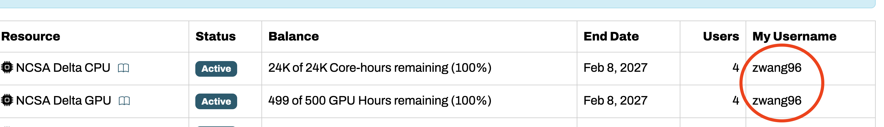

# NCSA Delta Cluster – Minimal GPU Usage Guide

## 0. Getting the delta account

You should be able to find the username from the ACCESS CONSOLE:




Then go to [https://identity.ncsa.illinois.edu/reset](https://identity.ncsa.illinois.edu/reset) to set your NCSA password. 


## 2. Check available GPU accounts

```bash
accounts
```

Use the GPU account name (example: `bghj-delta-gpu`) when submitting jobs.

---

## 3. Check GPU partitions

```bash
sinfo -s
```

Typical interactive GPU partitions:

* `gpuA40x4-interactive`
* `gpuA100x4-interactive`
* `gpuA100x8-interactive`
* `gpuH200x8-interactive`

---

## 4. Start an interactive GPU session

Template:

```bash
srun -A <account> -p <partition> \
    -N 1 \
    --gpus-per-node=1 \
    --ntasks=1 \
    --cpus-per-task=4 \
    --mem=20g \
    -t 01:00:00 \
    --pty /bin/bash
```

Example:

```bash
srun -A bghj-delta-gpu -p gpuA100x4-interactive \
    -N 1 --gpus-per-node=1 \
    --ntasks=1 --cpus-per-task=4 \
    --mem=20g -t 01:00:00 \
    --pty /bin/bash
```

